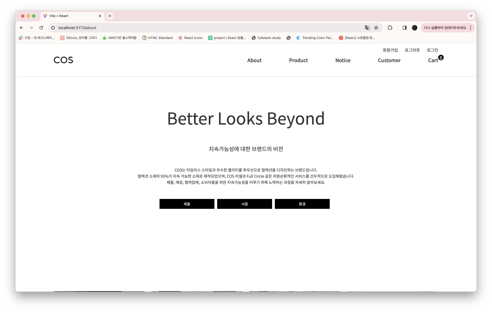
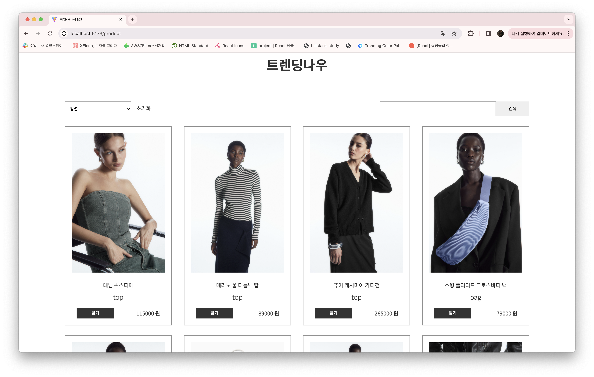
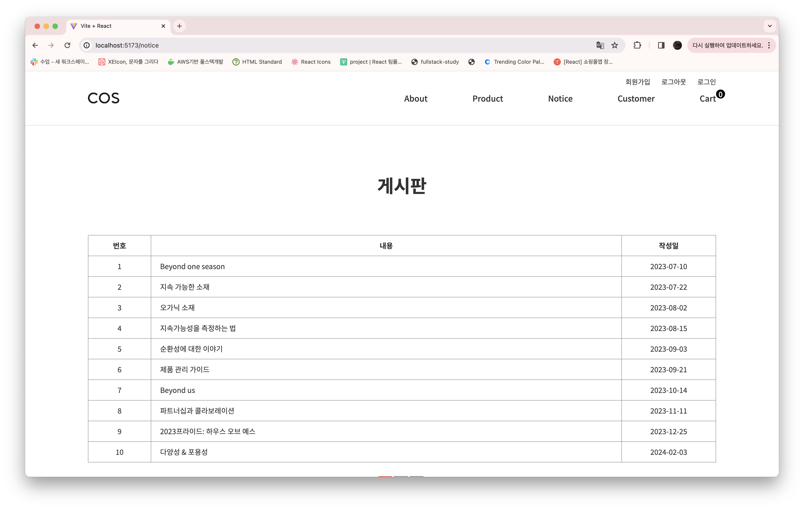
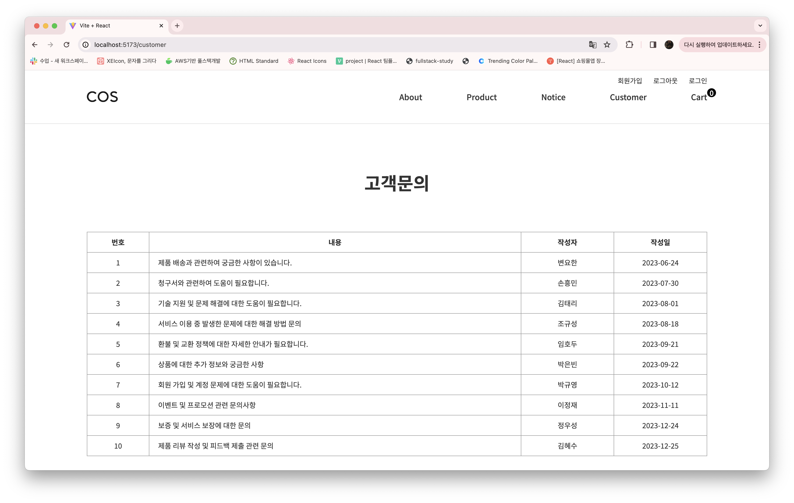
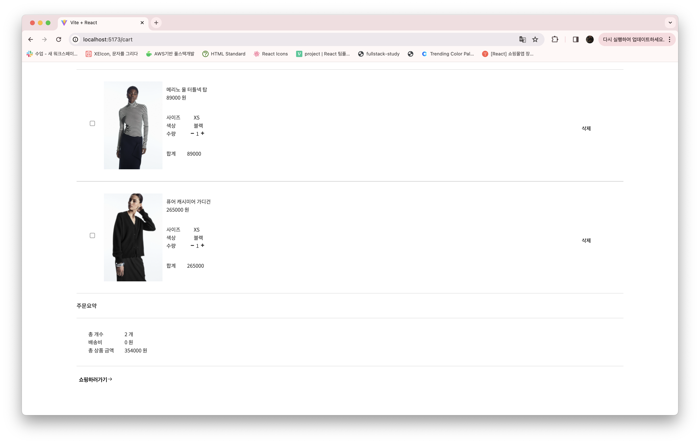

# 쇼핑몰 홈페이지 제작

## 프로젝트 사이트

 
 

## 프로젝트 참고 또는 리뉴얼 사이트

1. <a href="https://www.cos.com/ko-kr/index.html" target="_blank">COS</a>
2. 

## 사용기술

+React
+Styled-components
+Axios
+Router
+Redux-toolkit

### 프로젝트 주요 기능
1. 회원가입, 로그인, 로그아웃 (예정)
2. 장바구니
3. 검색
4. 필터 정렬
5. 게시판 게시글 등록, 수정, 삭제

## 프로젝트 작업 순서
1. 리뉴얼 웹 사이트 선정
2. 페이지 리뉴얼 및 디자인 수정
3. 와이어프레임, 스토리보드
4. React / Styled-Components / Redux-toolkit

# 프로젝트 기능 구현

### 1)메인
* swiper이용하여 slide 배너

### 2)About
* 브랜드소개

### 3)Product
* 상품 정렬
* 상품 정렬 초기화
* 상품 리스트 검색 기능
* 주문하기 클릭 시 장바구니 담기

### 4)Notice
* 페이지네이션
* 게시물 클릭 시 게시글 상세 내용 확인, 목록으로 이동

### 5)Customer
* 로그인 시 기능 접근 가능(예정)
* 글 작성 기능
* 글 수정 기능
* 글 삭제 기능
* 페이지네이션
* 목록가기
* 글 작성 취소

### 6)장바구니
* 상품 증감 수량과 수량에 따른 각각의 계산
* 총 개수, 총 합계 (예정)
* 체크박스 클릭 시 수량, 총 합계(예정)
* 선택상품삭제, 전체상품삭제 (예정)
* 쇼핑하러가기 버튼 클릭 시 상품리스트 이동

